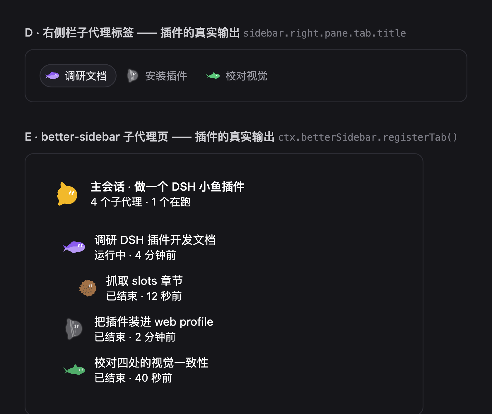

# DSH SubAgent Fish

给 DSH 的每个子代理一条会游动的小鱼。

`PolyForm Noncommercial 1.0.0` · 非商业使用 · [LICENSE](LICENSE)

同一条鱼由子代理的 ID 决定 —— 同一个子代理永远是同一条鱼，不同子代理自然分成不同的
鱼形、颜色与花纹。鱼不是图片，是现场用 SVG 画出来的。



*上图不是设计稿，是插件本体渲染出来的：`lib/client.js` 按 DSH 客户端加载器的规则跑起来，
抓住它真正注入的样式和真正注册的组件，用一份真实形状的会话列表渲染的结果。*

## 它做什么

只做两处，都是「加」而不是「换」：

| | 位置 | 做法 |
|---|---|---|
| **D** | 右侧栏的子代理对话标签 | 替换该标签**标题**的画法（`sidebar.right.pane.tab.title`，按标签类型分发）。子代理对话的类型没有占用这个位置，所以标签上写什么由本插件决定，而标签正文（真正的对话内容）一个字都不碰。 |
| **E** | `dsh-better-sidebar` 的子代理树页面 | 用它的公开接口 `ctx.betterSidebar.registerTab()` 注册**独立的一页**。它原本的子代理页、DSH 自己的一切都原样保留。没装 better-sidebar 时这一页自然消失，D 不受影响。 |

整条插件**没有主机侧逻辑**：鱼的身份是子代理 id 的纯函数，数据（会话列表 + 子代理目录投影）
本来就在客户端，所以主机侧是个空实现 —— 少一个可能出错的环节。

## 鱼是从哪来的

**身份。** `src/fish/identity.js` 把子代理 ID 做哈希，再决定鱼形 / 颜色 / 眼神 / 花纹 / 身形，
没有任何 `Math.random`。所以刷新、重启、换会话，同一条鱼永远长得一样。

**画鱼引擎。** `src/fish/engine.js` 是**生成文件**，由 `tools/sync-engine.mjs` 从
[MaiWork](https://github.com/CharTyr) 的正式画鱼源码加上「花纹」与「暂停」两项能力后生成，
和控制台里正式用的鱼是同一份代码。上游一改，生成脚本会直接报错，而不是悄悄产出走样的版本。

**对比度兜底。** DSH 的调色板整体偏中间调（相对亮度 107–186），但最暗的几条对着深色面板色
`#2c2c2e` 只有 2.7:1，低于 WCAG 对图形元素要求的 3:1。所以 `haloNeed()` 会按**真实对比度**
算一遍，只给确实不够的那一侧补一层极淡的反向轮廓 —— 不是给所有鱼都套光晕。

## 看一眼

不需要装 DSH，两个页面双击就能打开：

- **[preview/index.html](preview/index.html)** —— 手画的界面模型：四个位置的样子、
  十二个子代理的鱼、尺寸对照。可以现场调大小、描边、深浅主题、游动开关，
  还有「界面外壳 → 只看鱼」把所有模拟面板的底色和边框去掉。
- **[preview/plugin-render.html](preview/plugin-render.html)** —— 插件本体的真实输出（上面那张图）。

## 安装

插件是一个普通的 DSH 组合包（bundle）：`cordis.patch.yml` 声明挂载行，
`package.json` 的 `dsh.client` 声明浏览器侧，两半从同一个包名加载。

```bash
dsh plugin --profile web add link:/path/to/this/repo
```

如果这一步被拒绝（`pnpm` 可能顺手升级你 profile 里别的插件，撞上 dsh 版本兼容检查），
可以只手工加两处，不碰 pnpm：

1. profile 的 `package.json` 里加一行依赖：`"dsh-subagent-fish": "link:/path/to/this/repo"`
2. 同一个文件的 `dsh.profile.bundles` 末尾追加 `"dsh-subagent-fish"`
   （必须在 `dsh-better-sidebar` **之后** —— 本插件要向它注册页面）
3. 在 profile 目录下建链接：`ln -s /path/to/this/repo node_modules/dsh-subagent-fish`

然后重启 `dsh web`。可以先用 `dsh --profile web --dump-config` 确认多出
`id: subagent-fish` 这一行、且没有 skipped bundle。

## 开发

```bash
node tools/sync-engine.mjs      # 从 MaiWork 重新生成 src/fish/engine.js
node tools/sync-engine.mjs --check
node tools/build-client.mjs     # 生成 lib/client.js 与 lib/index.js
node tools/test-client.mjs      # 对已构建的 lib/client.js 跑 43 项检查
node tools/render-preview.mjs   # 把插件真实输出渲染成 preview/plugin-render.html
node preview/build.mjs          # 重新生成离线预览页 preview/index.html
node tools/verify-live.mjs 'http://127.0.0.1:3080/?token=…'
                                # 对着正在跑的 dsh web 核对：插件是否真的被送到浏览器
```

`tools/verify-live.mjs` 不带 URL 时只做离线部分（profile 接线 + 构建产物的契约）。
带上 `dsh web` 启动时打印的那个 URL，它会兑换 cookie、读回服务端真正组合出来的客户端
模块图，并核对本插件的 bundle 确实被服务出来 —— 这是唯一一件离线查不了的事。

`lib/` 是构建产物，但仍然提交：本插件不走 npm 发布，仓库直接可装。

## 状态

- 离线能验的都验了：43 项检查全绿，插件真实输出已渲染核对。
- **真实界面尚未核验**：需要重启 `dsh web` 才会加载，而重启会掐掉当时正在进行的会话。
  所以请自行重启后确认：右侧栏子代理标签上是否出现小鱼、better-sidebar 里是否多出
  「子代理 · 小鱼」一页。

## 设计取舍与踩过的坑

**为什么不动标题栏的子代理目录下拉。** 那个下拉是 DSH 自己一个三百多行的组件
（`CatalogDropdown`），**它里面的每一行没有留任何扩展口**。想在里面加鱼只有一条路：
整个顶掉它、自己重写一个长得一样的 —— 它自带的悬停展开、分支树、键盘操作、计数文案
全都要重新实现，而且以后 DSH 一升级就可能坏。所以暂缓，没有做。

**踩过的坑，都记在这里免得下次再踩：**

1. 会话列表摘要里**没有** `subagent.address`，只有 `parentId`。照直觉写会让上溯永远得到
   undefined —— 树只会显示当前会话的直接子代理，永远看不到整棵树。
2. 列表快照里**没有** `projectionValues`，名字要从 `displayTitle` 取。
3. React 里用 `childId === undefined` 决定调不调一个 hook，会让同一个组件在两次渲染里
   hook 数量不同 —— 标签一导航就崩。只有「prop 在不在」是稳定的。
4. `dsh.client.inject` 里写的是**包名**，会在客户端模块图里查找，找不到就跳过、不报错；
   而模块自己导出的 `inject` 才是 cordis 服务名。两者不是一回事。
5. 写渲染工具时：React 的 `paddingLeft` 要转成 `padding-left` 才有效。原样输出会让树
   看起来完全没有缩进，差点误判成插件的问题。

## 许可

**[PolyForm Noncommercial License 1.0.0](LICENSE)** —— 非商业用途随便用：个人研究、
实验、私人娱乐、爱好项目、教学、慈善与公共机构等，都算「许可用途」；商业用途不行。

需要留意的是，**这不是 OSI 认可的开源协议**，属于 source-available。要商业授权请联系作者。

有一处例外：`preview/dsh-theme.css` 是从 DSH 自己的主题包里原样提取的，而 DSH 以 **MIT**
发布。MIT 允许再分发，但要求保留原有声明 —— 所以那一份文件仍按 MIT 分发，**不受本仓库
协议约束**。完整的第三方声明见 [THIRD_PARTY_NOTICES.md](THIRD_PARTY_NOTICES.md)。

本插件通过公开接口与 DSH、`dsh-better-sidebar` 协作，但不包含它们的任何代码。
