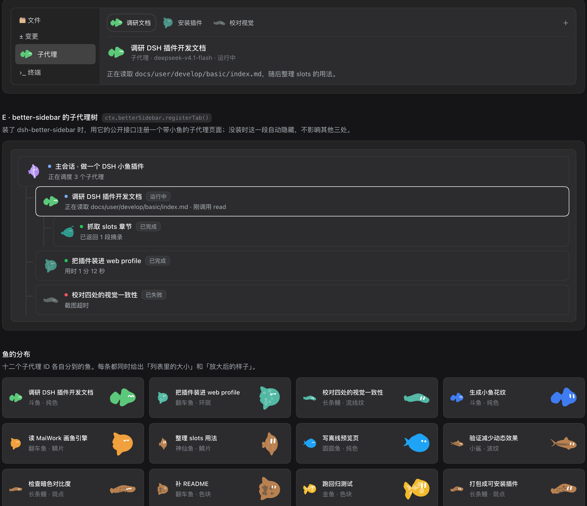
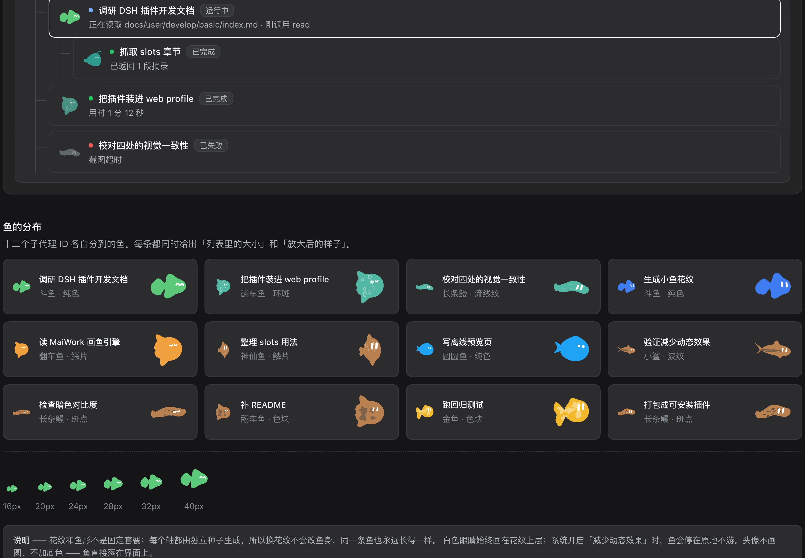

<div align="center">


# DSH SubAgent Fish

**给 DSH 的每个子代理一条会游动的小鱼**

同一条鱼由子代理的 ID 决定 —— 同一个子代理永远是同一条鱼，不同子代理自然分成不同的鱼形、颜色与花纹。

`PolyForm Noncommercial 1.0.0` · 非商业使用 · [LICENSE](LICENSE)

</div>

---

## 它长什么样

<div align="center">

</div>

上面这张不是设计稿，是**插件本体渲染出来的**：把 `lib/client.js` 按 DSH 客户端加载器的规则跑起来，
抓住它真正注入的样式和真正注册的组件，用一份真实形状的会话列表渲染的结果。

<div align="center">

</div>

<div align="center">

</div>

鱼不是图片，是现场用 SVG 画出来的。花纹也不是固定款式：每个轴都由独立种子生成，
换花纹不会改鱼身。

## 安装

插件是一个普通的 DSH 组合包（bundle）。**装之前先确认两件事**：

- 有一个能跑的 DSH（下面以 `web` profile 为例）；
- 可选：装了 [dsh-better-sidebar](https://github.com/omdsh-dev/DSH-better-sidebar) 才会有
  「子代理 · 小鱼」那一页。**没装也能用**，只是少一页，右侧栏标签上的鱼照常出现。

### 第一步：把仓库放到本机

```bash
git clone https://github.com/CharTyr/DSH-SubAgent-Fish.git
cd DSH-SubAgent-Fish
```

`lib/` 是构建产物，但已经提交进仓库，所以**不需要 npm install、也不需要构建**，克隆下来就能用。

### 第二步：装进 profile

```bash
dsh plugin --profile web add link:$PWD
```

### 如果上一步被拒绝

这不是你的问题：`pnpm` 在装的时候可能顺手把你 profile 里**别的**插件升到与当前 dsh 不兼容的版本，
DSH 的兼容检查就会拒绝整次安装并回滚。这种情况下手工加两处即可，完全不碰 pnpm：

1. 打开 `~/.dsh/profiles/web/package.json`，在 `dependencies` 里加一行：

   ```json
   "dsh-subagent-fish": "link:/你克隆到的绝对路径/DSH-SubAgent-Fish"
   ```

2. 同一个文件的 `dsh.profile.bundles` 数组**末尾**追加一项：

   ```json
   "dsh-subagent-fish"
   ```

   > 必须在 `dsh-better-sidebar` **之后** —— 本插件要向它注册页面，得先有它。

3. 在 profile 目录里建链接：

   ```bash
   cd ~/.dsh/profiles/web
   mkdir -p node_modules
   ln -s /你克隆到的绝对路径/DSH-SubAgent-Fish node_modules/dsh-subagent-fish
   ```

### 第三步：确认挂上了（可选）

```bash
dsh --profile web --dump-config | grep -A1 subagent-fish
```

应该看到：

```yaml
- id: subagent-fish
  name: dsh-subagent-fish
```

同时确认输出里**没有** `skipped bundle`。

### 第四步：重启

```bash
# 先停掉正在跑的 dsh web，再重新启动
dsh web
```

插件在启动时组合进插件树，所以**必须重启**才会加载。

### 第五步：核对

重启后应该看到：

- 打开任意一个子代理对话，右侧栏的标签上出现该子代理的小鱼；
- better-sidebar 侧边栏里多出一页「子代理 · 小鱼」（＋ 菜单里也在）；
- 同一个子代理反复进出，鱼始终是同一条；不同子代理是不同的鱼。

还想更确定一点，可以对着 `dsh web` 启动时打印的那个 URL 跑一次自检：

```bash
node tools/verify-live.mjs 'http://127.0.0.1:3080/?token=…'
```

它会兑换 cookie、读回服务端**真正组合出来的**客户端模块图，核对本插件的 bundle 确实被送到浏览器。

### 卸载

```bash
dsh plugin --profile web remove dsh-subagent-fish
```

手工装的话，把上面加的两处删掉、删掉那个软链接，重启即可。

## 它做什么

只做两处，都是「加」而不是「换」：

| | 位置 | 做法 |
|---|---|---|
| **D** | 右侧栏的子代理对话标签 | 替换该标签**标题**的画法（`sidebar.right.pane.tab.title`）。子代理对话的类型没有占用这个位置，所以标签上写什么由本插件决定，而标签正文一个字都不碰。 |
| **E** | `dsh-better-sidebar` 的子代理树页面 | 用它的公开接口 `ctx.betterSidebar.registerTab()` 注册**独立的一页**。它原本的子代理页、DSH 自己的一切都原样保留。没装 better-sidebar 时这一页自然消失，D 不受影响。 |

整条插件**没有主机侧逻辑**：鱼的身份是子代理 id 的纯函数，数据本来就在客户端。

## 离线预览

不用装 DSH，双击就能打开：

- **[preview/index.html](preview/index.html)** —— 手画的界面模型，可以现场调大小、描边、深浅主题、
  游动开关，还有「界面外壳 → 只看鱼」把所有模拟面板的底色和边框去掉。
- **[preview/plugin-render.html](preview/plugin-render.html)** —— 插件本体的真实输出。

## 开发

```bash
node tools/sync-engine.mjs      # 从上游画鱼源码重新生成 src/fish/engine.js
node tools/sync-engine.mjs --check
node tools/build-client.mjs     # 生成 lib/client.js 与 lib/index.js
node tools/test-client.mjs      # 对已构建的 lib/client.js 跑 43 项检查
node tools/render-preview.mjs   # 把插件真实输出渲染成 HTML
node tools/build-logo.mjs       # 重新生成 logo.svg / logo.png
node preview/build.mjs          # 重新生成离线预览页
```

`src/fish/engine.js` 是**生成文件**，由 `tools/sync-engine.mjs` 从
[MaiWork](https://github.com/CharTyr/MaiWork) 的正式画鱼源码加上「花纹」与「暂停」两项能力后生成，
和控制台里正式用的鱼是同一份代码。上游一改，生成脚本会直接报错，而不是悄悄产出走样的版本。

`logo.svg` / `logo.png` 同样是生成的：用的就是插件里同一个 `fishSvg()`，固定成一条绿色斗鱼、圆眼、无花纹。

## 状态

- 离线能验的都验了：43 项检查全绿，插件真实输出已渲染核对。
- **真实界面尚未核验**：需要重启 `dsh web` 才会加载。

## 许可

**[PolyForm Noncommercial License 1.0.0](LICENSE)** —— 非商业用途随便用：个人研究、实验、
私人娱乐、爱好项目、教学、慈善与公共机构等，都算「许可用途」；商业用途不行。

需要留意的是，**这不是 OSI 认可的开源协议**，属于 source-available。要商业授权请联系作者。

有一处例外：`preview/dsh-theme.css` 是从 DSH 自己的主题包里原样提取的，而 DSH 以 **MIT** 发布。
所以那一份文件仍按 MIT 分发，**不受本仓库协议约束** —— 完整声明见
[THIRD_PARTY_NOTICES.md](THIRD_PARTY_NOTICES.md)。
