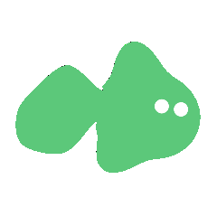

<div align="center">



# DSH SubAgent Fish

**给 DSH 的每个子代理一条会游动的小鱼头像**

同一条鱼由子代理的 ID 决定 —— 同一个子代理永远是同一条鱼，不同子代理自然分成不同的鱼形、颜色与花纹。子智能体运作时会游动，停止时鱼也会停止游动。

哦——小鱼————！

`PolyForm Noncommercial 1.0.0` · 非商业使用 · [LICENSE](LICENSE)

</div>

---

## 样图


## 安装

插件是一个普通的 DSH 组合包（bundle）。**装之前先确认两件事**：

- 有一个能跑的 DSH（下面以 `web` profile 为例）；
- 需要搭配 [dsh-better-sidebar](https://github.com/omdsh-dev/DSH-better-sidebar) 使用

### 直接从 GitHub 装（推荐）

```bash
dsh plugin --profile web add github:CharTyr/DSH-SubAgent-Fish
```

`lib/` 是构建产物，但已经提交进仓库，所以**不会触发构建、也不需要 npm install**，装完即用。

想固定在某个版本而不是跟着默认分支走，在仓库名后面加 `#` 加标签：

```bash
dsh plugin --profile web add github:CharTyr/DSH-SubAgent-Fish#v0.1.0
```

### 或者从本地克隆装

```bash
git clone https://github.com/CharTyr/DSH-SubAgent-Fish.git
cd DSH-SubAgent-Fish
dsh plugin --profile web add link:$PWD
```

### 如果被拒绝了

这不是你的问题：`pnpm` 在装的时候可能顺手把你 profile 里**别的**插件升到与当前 dsh 不兼容的版本，
DSH 的兼容检查就会拒绝整次安装并回滚。这种情况下手工加两处即可，完全不碰 pnpm：

1. 打开 `~/.dsh/profiles/web/package.json`，在 `dependencies` 里加一行
   （`github:` 或 `link:` 按你上面用的那种）：

   ```json
   "dsh-subagent-fish": "github:CharTyr/DSH-SubAgent-Fish"
   ```

2. 同一个文件的 `dsh.profile.bundles` 数组**末尾**追加一项：

   ```json
   "dsh-subagent-fish"
   ```

   > 必须在 `dsh-better-sidebar` **之后** —— 本插件要向它注册页面，得先有它。

3. 在 profile 目录里装上去：

   ```bash
   cd ~/.dsh/profiles/web
   pnpm install
   ```

### 确认挂上了（可选）

```bash
dsh --profile web --dump-config | grep -A1 subagent-fish
```

应该看到：

```yaml
- id: subagent-fish
  name: dsh-subagent-fish
```

同时确认输出里**没有** `skipped bundle`。

### 重启

```bash
# 先停掉正在跑的 dsh web，再重新启动
dsh web
```

插件在启动时组合进插件树，所以**必须重启**才会加载。

### 核对

重启后应该看到：

- better-sidebar 侧边栏里多出一页「子代理 · 小鱼」
- 同一个子代理反复进出，鱼始终是同一条；不同子代理是不同的鱼。

还想更确定一点，可以对着 `dsh web` 启动时打印的那个 URL 跑一次自检：

```bash
node tools/verify-live.mjs 'http://127.0.0.1:3080/?token=…'
```

它会兑换 cookie、读回服务端**真正组合出来的**客户端模块图，核对本插件的 bundle 确实被送到浏览器。

### 卸载

```bash
dsh plugin --profile web remove dsh-subagent-fish
```

手工加的话，把上面加的两处删掉，重启即可。

## 它做什么

只做两处，都是「加」而不是「换」：

| | 位置 | 做法 |
|---|---|---|
| **D** | 右侧栏的子代理对话标签 | 替换该标签**标题**的画法（`sidebar.right.pane.tab.title`）。子代理对话的类型没有占用这个位置，所以标签上写什么由本插件决定，而标签正文一个字都不碰。 |
| **E** | `dsh-better-sidebar`「任务管理」页里已有的子代理行 | 把鱼挂到它**每一行的状态点左边**。它没留行级扩展口，同 id 接管又会直接抛错，所以只能等它渲染完再插进去 —— 这是全插件唯一碰别人 DOM 的地方，见下。没装 better-sidebar 时这部分自动不生效，D 照常。 |
| **F** | DSH「智能体团队」的成员行 | 同 E：团队插件只注册了会话标题栏的一个按钮，名单面板是它自己画的，也只能等它渲染完再插进去。名单取自会话投影 `agentTeam`。 |

整条插件**没有主机侧逻辑**：鱼的身份是子代理 id 的纯函数，数据本来就在客户端。

### 什么时候会游

**子代理在跑，鱼就游；不在跑，鱼就静着。**

这不是随手加的规则，是让「动」本身带上信息：一屏几十条鱼全在扭只会晃眼，
而现在扫一眼就知道谁还在干活。

实现上不带游动标记的鱼**引擎根本看不见**（`fishSvg` 的 `still` 选项），
所以静止的鱼不占动画开销，也不会有「半动」的中间状态。状态一变，那一条鱼会
被换成对应的版本。

### 关于 E / F 为什么是「插进 DOM」而不是插槽

better-sidebar 的 `subagent` 标签（中文名「任务管理」）渲染的是它自己的 `SubagentView`，
**每一行没有留任何扩展口**；想用同 id 顶掉它也不行 —— 它的 `registerTab` 遇到重复 id
会直接抛错，内置标签走的是同一个注册表。

所以 E / F 只能在它们渲染出来的行上挂，并且写得尽量防守：

- 锚点用 `role="treeitem"` + `aria-level` 这组 **ARIA 语义**，不是会随构建变化的 CSS 类名；
- 必须同时找得到子代理行专有的标签元素才动手，因此**不会误伤文件树**等别的 `treeitem`；
- 从行里的文字反查子代理 id，查不到就**什么都不做**，绝不猜；
- 它升级把这套结构改掉时，最坏结果是**鱼不出现**，不会把它的页面弄坏；
- 插件卸载时断开观察、并把自己插进去的鱼收干净。


## 许可

**[PolyForm Noncommercial License 1.0.0](LICENSE)**

`preview/dsh-theme.css` 是从 DSH 自己的主题包里原样提取的，而 DSH 以 **MIT** 发布。该文件仍按 MIT 分发，**不受本仓库协议约束**

## Friendly Links
[LINUX DO](https://linux.do/)
